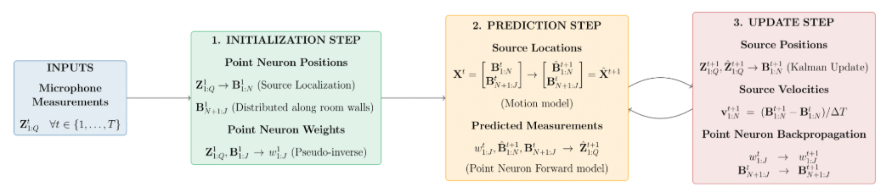

# Point-Neuron-Embedded-Kalman-Filter


Official implementation of **“Point Neuron Embedded Kalman Filter for Narrowband Sound Source Tracking,”** published in the proceedings of the 34th European Signal Processing Conference 2026, Brussels, Belgium.

Developed by **Vishwanath Vinod** under the guidance of **Prof. Thushara Abhayapal** as part of the Future Research Talent internship at the Australian National University.

## Paper

* **Authors:** Vishwanath Vinod, Shaoheng Xu, Prasanga Samarasinghe, Amy Bastine, Thushara D. Abhayapala
* **Conference:** 34th European Signal Processing Conference, August 31st- September 4th 2026
* **Publication:** IEEE Explore
* **Paper:** [EUSIPCO 2026 Proceedings](https://eurasip.org/Proceedings/Eusipco/Eusipco2026/pdfs/0000016.pdf)

## Overview

Dynamic pricing optimizes revenue by adjusting prices for each customer group based on their demand functions. However, this can lead to different prices for the same product across groups, potentially enabling unintended price discrimination. This becomes a malicious problem if pricing decisions exploit latent sensitive attributes such as race, gender, or ethnicity. **FairSwarm** introduces a cooperative multi-agent reinforcement learning framework that jointly optimizes profitability and fairness across customer groups. 

The approach extends decomposed Multi-Agent Deep Deterministic Policy Gradient (MADDPG) through:

* **Local critics** that optimize individual group profits.
* **A global fairness critic** that promotes fairness (equitable prices) using Jain’s Fairness Index.
* **A dual-reward learning objective** that jointly incorporates individual profitability and group-level fairness.
* **A tunable control parameter** that adjusts the trade-off between fairness and profitability, enabling flexible prioritization of the two objectives.

The framework is evaluated in simulated dynamic-pricing environments with varying numbers of customer groups.
## Alogithm

<p align="center">
  
</p>

*Overview of the proposed Point Neuron Embedded Kalman Filter.*

## Experimental Setup

| Parameter         | Setting       |
| ----------------- | ------------- |
| Customer groups   | 2, 4, 6       |
| Price range       | 100–500       |
| Customers         | 600 per group |
| Initial inventory | 300 per group |
| Training episodes | 1,000         |

The dual-reward formulation and its trade-off between fairness and profitability are evaluated against existing reinforcement learning baselines. See the paper for detailed results and experimental analysis.

## Repository Structure

```text
.
├── customer.py          # Customer interactions and influx
├── demand.py            # Group-specific demand functions
├── env.py               # Custom Gym environment
├── networks.py          # Actor and critic networks
├── dec_maddpg_dual.py   # Dual-reward decomposed MADDPG
├── fairness_metric.py   # Fairness metrics
├── replay_buffer.py     # Experience replay
├── noise.py             # OU exploration noise
├── plot_fairness.py     # Fairness–profit visualizations
└── main.py              # Training and experiments
```

## Getting Started

```bash
git clone <REPOSITORY_URL>
cd <REPOSITORY_NAME>
pip install -r requirements.txt
```

Run the training and evaluation scripts using the configurations specified in the code.

## Citation

If you use this work, please cite:

```bibtex
@InProceedings{10.1007/978-3-032-24804-6_11,
  author    = {Vinod, Vishwanath and Kalaimani, Rachel Kalpana},
  title     = {Cooperative Multi-agent Reinforcement Learning for Fair Dynamic Pricing},
  booktitle = {Intelligent Computing},
  editor    = {Arai, Kohei and Lorenz, Pascal},
  publisher = {Springer Nature Switzerland},
  year      = {2026},
  pages     = {188--205},
  address   = {Cham},
  isbn      = {978-3-032-24804-6},
  doi       = {10.1007/978-3-032-24804-6_11}
  }
